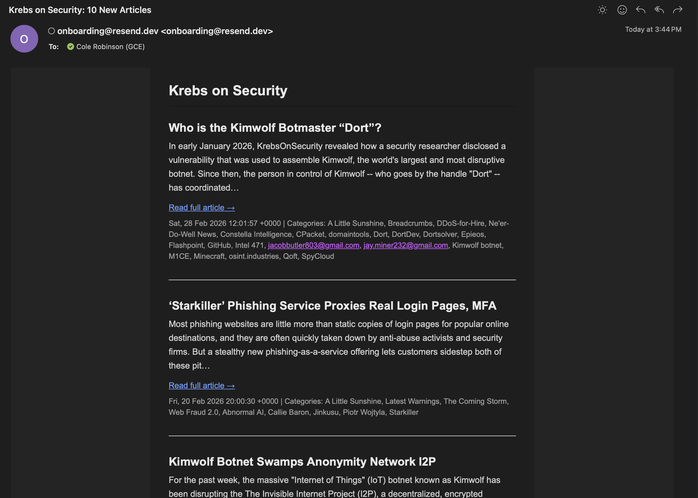

# Krebs Newsletter

A TypeScript and Node.js tool that monitors the Krebs on Security RSS feed and sends daily updates via Resend. It uses a GUID-based deduplication system to ensure subscribers only receive new articles, with the state stored in a local JSON file.

## Prerequisites

- Node.js 20+
- pnpm
- Resend account (free tier supports 3,000 emails per month)

## Setup Steps

1. Clone the repository to your local machine.
2. Run `pnpm install` to install dependencies.
3. Copy `.env.example` to `.env`.
4. Fill in `RESEND_API_KEY` and `NEWSLETTER_RECIPIENTS` in the `.env` file.
5. Run `pnpm test` to verify the installation and core logic.
6. Run `pnpm start` to manually trigger a newsletter check.

## GitHub Actions Setup

This project includes a workflow to run the newsletter check daily at noon UTC.

1. Push your repository to GitHub.
2. Navigate to Settings > Secrets and variables > Actions.
3. Add the following repository secrets:
   - `RESEND_API_KEY`: Your Resend API key.
   - `NEWSLETTER_RECIPIENTS`: Comma-separated list of recipient emails.
4. Optionally add `NEWSLETTER_FROM` if you're using a verified domain (see below).
5. The workflow triggers automatically, but you can also run it manually from the Actions tab by selecting "Krebs Newsletter" and clicking "Run workflow".

## Adding Coworkers

The `NEWSLETTER_RECIPIENTS` variable supports multiple addresses separated by commas, such as `user@example.com,coworker@example.com`.

The default `onboarding@resend.dev` sender address only works for the email associated with your Resend account. To send to coworkers or external addresses, you must verify a custom domain in your Resend dashboard. After verification, set the `NEWSLETTER_FROM` environment variable to an address like `newsletter@yourdomain.com`.

## Architecture Overview

The tool follows a linear pipeline to process the feed and deliver updates:

```text
fetchFeed (RSS)
      ↓
loadSentArticles (JSON)
      ↓
filterNewArticles
      ↓
[if empty: exit]
      ↓
formatNewsletter
      ↓
sendNewsletter (Resend)
      ↓
saveSentArticles (JSON)
```


## Example newsletter

Below is an example of the formatted newsletter you can expect to receive from this tool.


